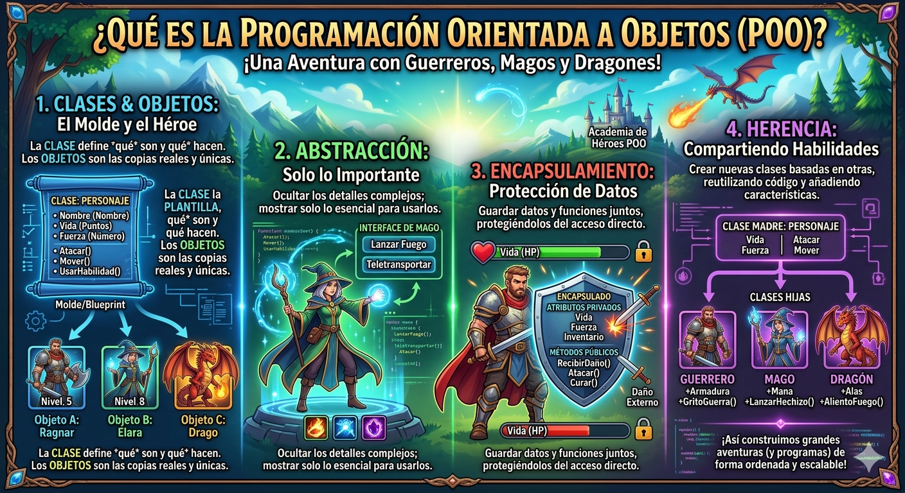

# python_poo
introduccion a la programacion orientada en python

## ¿ por que aprender poo ?

imagina que quieres crear un videojuego. Tiene guerreros, magos, dragones... cada uno con sus propios puntos de vida, ataques y habilidades. ¿ como los organizo en codigo sin repetir todo una y otra vez ?

- La **programacion orientada a objetos (poo)** es la respuesta. en lugar de escribir instrucciones sueltas, modelas el mundo real con *objetos* que tiene caracteristicas y comportamiento. es la forma en la que estan construidos la malloria de los programas profesionales del mundo



## clase y objeto

- una clase es un tipo de gato cuyas variables se llaman objetos o instancias.

- la clase es la definicion del concepto del mundo real y los objetos o instancias son el propio "objeto" del mundo real.

- las clases estan compuestas por dos elementos:
     - **Atributos:** informacion que almacena la clase. 
     - **Metodos:** operaciones que pueden realizarse con la clase.

## Definicion de una clase en python 

```
python 

class Nombreclase:

    def_init_(self,variable1,variable2):
     self.atributo1 = valor1
     self.atributo2 = valor2

    def nombremetodo(Self):
        bloquecodigo


```

- `class`: palabra reservada en python para definir una clase
-  ` Ǹombreclas ` : nombre de la clase que se quiere crear.
- ` def `: palabras reservada en python que se utiliza para definir tanto el constructor de la clase (metodo que se ajecuta la primera vez que una clase) como los diferentes metodos que tiene.
- ` _init `: palabra reservada en python para definir el metodo constructor de la clase. El metodo ` _init_ ` es lo primero que se ejecuta cuando creas una objeto de una clase.
- `(self, variablex) ` : parametros del constructor de la clase. El parametro `self` es obligatorio y despues puede tener tantos parametros como quieras. la forma de añadir parametros es la misma que en las funciones.
- ` self.AtributoX` : forma de utilizacion y acceso a los atributos de la clase.
- `nombreMetodo ` : mombre del metodo de la clase.
- `self` : parametros del metodo. el parametro `self`es obligatorio y despues puedes tener tantos parametros `self ` es obligatorio y puedes  tener tantos parametros como quieras. la forma de añadir parametros es la misma que en las funciones.
- ` bloquecodigo ` : instrucciones  que ejecutara el metodo

**Al definir una tenga en cuenta:**
- puedes definir tantos atributos como necesites.
- puedes definir tantos metodos como nesesites.
- puedes definir tantos parametros en el constructor y en los metodos como necesites.

## Ejemplo 1

- crear una clase que represente una persona
- Atributos: nombre, apellidos y edad
- Metodos: mostrar la informacion de la persona

### Codigo 
``` python
class persona:

    def _init_(self, nombre, apellido, edad):
        self,nombre = nombre
        self,apellido = apellido
        self,edad = edad
    
    def mostrarpersona(self):
        print("nombre: ", self.nombre)
        print("apellido: ", self.apellido)
        print("edad: ", self.edad)

def main():
    print("vamos a aprender poo...")
    persona_1 = persona("lorenzo", "perez", 18)
    persona_1.mostrarpersona()


if _name_ == main():
    main()
```

## composicion

- consiste en la creacion de nuevas clases a partir de otra clases ya exitentes que actuan como elementos compositores de la nueva 
- las clases existentes seran atributos de la nueva clase 

### Ejemplo

- una coordenada en dos dimensiones esta compuestas por dos valores, el valor en el eje de la x y y el valor en el eje las y. esto podria ser una clase
- un cuadrado esta compuestos por 4 coodenadas que son los cuatro vertices. esto podria ser una clase que estas compuesta por cuatro clases del objeto coordenada

### Codigo python

```python
class coordenada:
    # METODO CONSTRUCTOR
    def _init_(sef, x, y):
        self,x = x
        self,y = y

# metodo de acceso

    def getX(self):
        return self._X

    def setx(self, x ):
        return

    def gely(self):
        return self._y

    def sety(self, y):
        self. y = y


        def mostrarcoordenada(self):
        print("(",self.x,",",self.y, ")")
class cuadrado:
    # metodo constructor
    def _init_(self, v1, v2, v3, v4):
        self.v1 = v1
        self.v2 = v2
        self.v3 = v3
        self.v4 = v4

    def mostrarvertices(self):
        print("El cuadrado esta compuesto por los siguientes vertices:")
        self.v1.mostrarcoordenada()
        self.v2.mostrarcoordenada()
        self.v3.mostrarcoordenada()
        self.v4.mostrarcoordenada()


```

## Encapsulacion

- uno de los los objetivos que tiene la poo es proteger los datos de acceso o usos no contralados y esto es l que se conoce como **encapsulacion**
- los datos (atributos) que componen una clase puede ser de dos 
tipos :
     - **publicos :** los datos son accesible sin control es decir, los datos pueden ser usados sin ningun tipo de mecanismo que protega ante no autorizado o indebido.
     - **privados :** los datos no pueden ser accedidoa sin control y para accerder a ellos se debera implementar un metodo que acceda a ello. De esta manera, los datos unicamente seran accedidos directamente por la propia clase.
- la encapsulacion  tambien puede realizarse sobre los metodos. 
- la defifnicion de atrivutos privados se realisan incluyendo los caracteres(dos rallas de piso)
entre la palabra **self** y el nombre del atributo

### ejemplo 

### codigo  en python

```python
class coordenada:
    # METODO CONSTRUCTOR
    def _init_(sef, x, y):
        self,x = x
        self,y = y

# metodo de acceso

    def getX(self):
        return self._X

    def setx(self, x ):
        return

    def gely(self):
        return self._y

    def sety(self, y):
        self. y = y


        def mostrarcoordenada(self):
        print("(",self.x,",",self.y, ")")
class cuadrado:
    # metodo constructor
    def _init_(self, v1, v2, v3, v4):
        self.v1 = v1
        self.v2 = v2
        self.v3 = v3
        self.v4 = v4

    def mostrarvertices(self):
        print("El cuadrado esta compuesto por los siguientes vertices:")
        self.v1.mostrarcoordenada()
        self.v2.mostrarcoordenada()
        self.v3.mostrarcoordenada()
        self.v4.mostrarcoordenada()


```